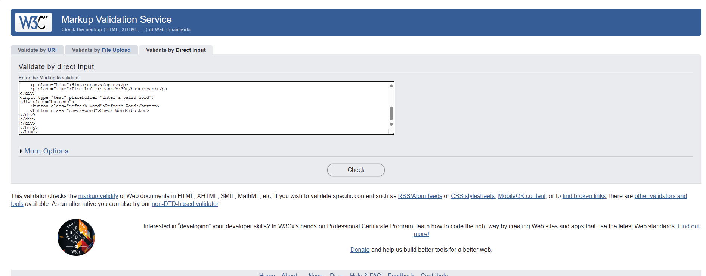
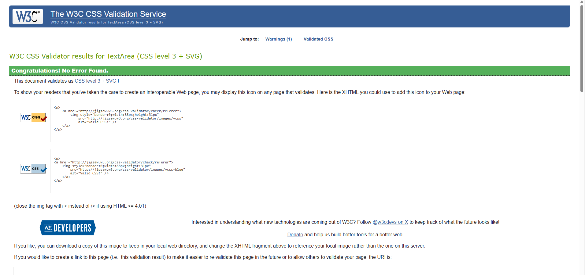

# Word Scramble Game

## Description

The purpose of this site is to make a user-friendly game using HTML, CSS and JavaScript. I wanted to make something that would use cognitive functions and also be fun. 
I wanted the game to be as user-friendly as possible and I believe tht I have achieved this. I have come a long way since my first project. 

I built this game in order to showcase what I have learned so far through my Level 5 Diploma in Web Development through the [Code Institute] (<https://codeinstitute.net>)

Troughout this project so far I have grown in confidence using HTML and CSS and JavaScript and feel that I can code to a certain point and create a simple but effective game that hopefully is user-friendly, something I previously could not but that is why I wanted to do this course, to learn and devlop new skills. 

I didn't just use the course material and needed extra support along the way. I got this through various youtube walkthroughs, plus support from stack overflow and W3Schools where there are many quizes to test your knowledge. I also had support from fellow students on my course that found this a lot easier than myself. 

## UX Design

### Project Goals

My goals were to make this game visually user-friendly and easy to use for the user. It would give the user a chance to read the letters and use the hint to work out the word. If the user types in the wrong word a caption box will come up to inform them that they have made a mistake. If they types the correct word thn a caption box will come up to inform them that have found the correct word. There is a timer limit of 30 seconds for the user to come up with the correct word. I created a background in CSS and random words and hints using JavaScript. 
I used wireframes to sketch out a rough idea of how this would look on Web Browser, Tablet and Mobile Phone. 

## Wireframes

### Testing

I tested my HTML and CSS code using the W3Schools Validation tools. I tested the JavaScript using JestTest using an extension package in VS Code. 
I also completed manual testing and tested out all functions to make sure they worked. 

### Manual Testing

| Feature                 |  Action                  | Expected Result                                |  Tested             | Passed        |
| -----------------------:|:------------------------:| ----------------------------------------------:|--------------------:|--------------:|
|  Word Box               | Random Letters           | User can see random letters                    | Yes                 | Yes           |
|  Hint                   | Description of the word  | User can guess the word from the description   | Yes                 | Yes           |
|  Time Left              | Time counts down         | Timer counts down from 30 seconds              | Yes                 | Yes           |
| Refresh Button          | Click on Refresh Button  | User can refresh the word                      | Yes                 | Yes           |
| Check Button            | Click on Check Button    | User can check the word to see if correct      | Yes                 | Yes           |

## Deployment

My site was deployed on GitHub pages at https://epageone.github.io/Word Scramble Game/

## Credits

I used W3Schools JavaScript examples and 'https://fonts.googleapis.com/css2?family=Poppins:ital,wght@0,100;0,200;0,300;0,400;0,500;0,600;0,700;0,800;0,900;1,100;1,200;1,300;1,400;1,500;1,600;1,700;1,800;1,900&display=swap'
For the font and background colour I used https://colorhunt.co/palette/
